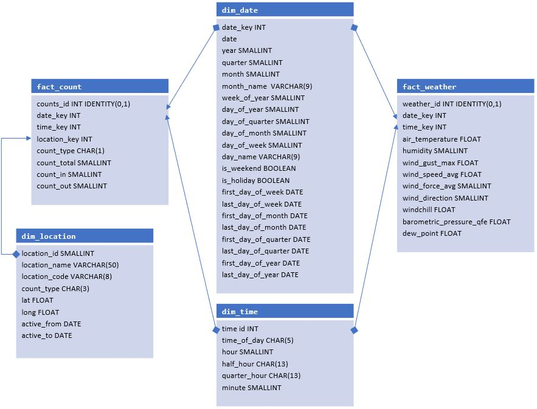
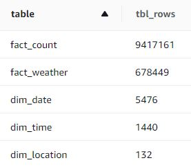

# Analytics DB With 'Open Data' from Zurich, Switzerland

Capstone Project Data Engineer Nanodegree, June 2020

## Introduction

### Project Background

Starting this project, I wanted to work with the largest publicly available local datasets I can find. I turned out that there is not so much of impressive size around here, but at least [Open Data Zurich](https://data.stadt-zuerich.ch/) is providing some multi-million-row sets (altough they are far away from being "big data").

In terms of content, my goal was to combine different data sets in a Redshift database in such a way that they would be easy to extract for analytical purposes.

### Project Overview

I worked with two data sets:

1. **Traffic count for non-motorized traffic (pedestrians and bicycles)**, which has been collected every quarter of an hour since the end of 2009 and at a total of over 130 changing stations.
2. **Weather measurements (temperature, humidity, wind, precipitation etc.)** that has been collected every ten minutes since 2007 (one station only).

Use Case:

Data scientists investigating how the traffic at the various locations has developed over the years and what influence the weather may hav on it. 

Requirements:

To provide the data in an way that is easy to the handle but at the same time allows flexibility, scalability and the possibility to add more dimensions and facts in the future (e.g. counts for motorized traffic, data on air pollution).

Solution:

Create a DB containing each a fact table for the traffic counts and the weather data. Make joining them by date and time easy by linking those fact tables through a dim_date and a dim_time table. (Taking into account that the measurement is not synchronized.)

Project Flow:

## Data

### Data Model

The data model contains five tables:

`fact_count` is by far the largest table, with more than 9 Mio rows:

### Data Sources

- traffic counts: CSV file per year, is downloaded programatically.
- weather data:
  - Single CSV file for all data up to 2019, is downloaded programatically.
  - Data for actual year has to be requested from API.
- traffic locations: JSON file, has to be downloaded manually (request by email).

### Data Quality Checks

Quality checks were incorporated into the ETL process. The script tests for missing values (and handles them appropriately). It also test for duplicate records and eliminates them prior to loading into the database, as Redshift does not enforce uniqueness and other constraints.

## Other Scenarios

**If the database size was increased by 100X**, it would be difficult to maintain query performance when joining the pricing, labels and drug_events tables via NDC code. In this case it would be worth considering moving to a NoSQL database structure such as Cassandra, with each table consolidating the pricing, adverse events and label information for a single drug. This would facilitate the main use case of the database to research individual medications. However, it would reduce the ability of the database to support aggregate trend analysis of adverse reactions over, say, brand-name vs generic drugs or drug types over time.

**To update the database every morning at 7am**, it would make sense to utilize a pipeline scheduling application such as Airflow. The downloading tasks could be implemented using Airflow hooks to AWS S3 buckets, and the uploading could utilize existing hooks to Redshift. Transform tasks could be implemented using python callables with fairly limited modifications to the existing ETL script. Or, custom operators could be developed to support code reuse.

**If the database needed to be accessed by 100+ people**, one could enable concurrency scaling in Redshift. In this case Redshift adds clusters as needed to support increases in demand for concurrent querying of the database. There are a number of technical requirements for concurrency scaling such as node type, sort key type (cannot use interleaved sorting) and query type (e.g. read-only) that must be met. The existing data model and cluster configuration would need to be reviewed to meet these requirements.

## Acknowledgements

https://wiki.postgresql.org/wiki/Date_and_Time_dimensions
https://nicholasduffy.com/posts/postgresql-date-dimension/
